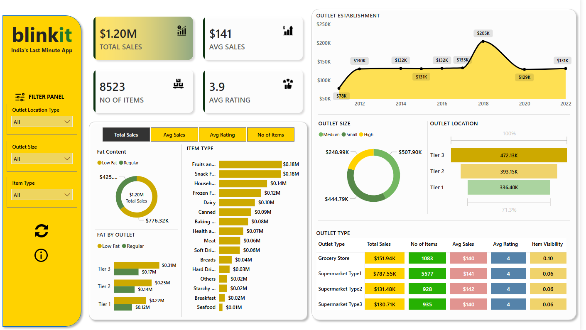

# 🛒 Blinkit Sales Analytics Dashboard

## Overview

An interactive Power BI dashboard analysing Blinkit's retail outlet performance across outlet types, sizes, location tiers, and product categories. Built with a Blinkit-inspired UI, it features **7 visualisations**, dynamic slicers, and KPI cards — translating raw transactional data into actionable business intelligence.

---

## Business Objective

Identify which outlet types, location tiers, and product categories drive the most revenue — and surface opportunities for growth, inventory optimisation, and strategic expansion.

---

## KPIs Tracked

| Metric | Value |
|---|---|
| Total Sales | $1.20M |
| Average Sales | $141 |
| No. of Items | 8,523 |
| Avg Customer Rating | 3.9 / 5 |
| Item Visibility | 0.06 – 0.10 |

---

## Analysis Performed

- Sales trend by outlet establishment year (2012–2022)
- Revenue breakdown by outlet type, size, and location tier
- Product category ranking across 16 item types
- Fat content preference analysis (Low Fat vs Regular) by tier
- Outlet-level performance table with sales, rating, and item visibility

---

## Key Insights

- **Supermarket Type 1** drives **~65% of total revenue** ($787.55K) — far outpacing all other outlet types
- **Tier 3 locations outperform Tier 1** ($472K vs $336K), signalling untapped potential in smaller markets
- **2018 was peak expansion year** ($205K); the subsequent decline suggests strategic consolidation
- **High-size outlets generate 2x the revenue** of Small outlets ($507.90K vs $248.99K)
- **Fruits and Vegetables & Snack Foods** are top categories at $0.18M each; **Regular fat products** outsell Low Fat ($776K vs $425K)

---

## Tools & Skills

`Power BI` &nbsp;`DAX` &nbsp;`Power Query` &nbsp;`Data Modelling` &nbsp;`Conditional Formatting` &nbsp;`Interactive Slicers` &nbsp;`Dashboard UI Design`

---

## Dashboard Preview

---

## Business Recommendations

1. **Expand Supermarket Type 1** — highest ROI outlet type; further investment in inventory depth and delivery coverage is justified
2. **Target Tier 3 markets** — consistent revenue outperformance over Tier 1 makes this the priority for new outlet rollouts
3. **Audit Grocery Store efficiency** — high item visibility (0.10) but low revenue conversion points to a product mix problem
4. **Align inventory to Regular fat demand** — a 65:35 revenue split favours Regular products; supply planning should reflect this

---

##  Skills Demonstrated

- End-to-end BI dashboard development — data cleaning, modelling, DAX measures, and visual design
- Translating multi-dimensional retail data into structured, stakeholder-ready insights
- Designing an intuitive, branded UI with dynamic filtering and drill-down capability

---

## Conclusion

The Blinkit Sales Analytics Dashboard showcases applied business intelligence across the full analytics workflow — from raw data to executive-ready insights. It reflects the core competencies expected in Business Analyst and Product Analyst roles: structured thinking, visual clarity, and data-driven decision support.

---

